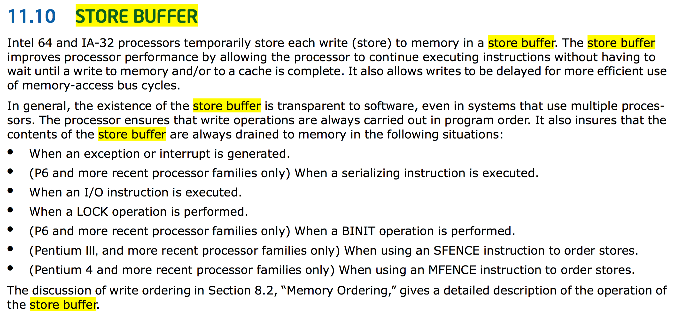

1.  [Augy St. Clair](index.html)
2.  [Augy St. Clair’s
Home](10453289.html)

#  Augy St. Clair : Non-Atomics Talk Follow-Up 

Created by  Augy St. Clair, last modified on
Mar 08, 2018

# Clarifications and Corrections

  - I stated that atomic stores include a "hint" not to use the store
    buffer. This isn't accurate. It is true that the store buffer is
    drained on an atomic write, but only because `mfence` instructions
    (which follow every `std::atomic<>::store()` on x86) drain the store
    buffer. I've included a list of events that drain the store buffer
    below.

  - When describing acquire semantics (around 16:50), my description was
    not direct enough; it made it sound like acquire memory barriers
    somehow force *other* threads to complete their stores, which is
    fundamentally not how memory barriers work, because memory barriers
    only affect reordering in **our** thread, not others. A better
    description would be that acquire barriers force loads in *our*
    thread not to be reordered before the acquire, which makes intuitive
    sense: you don't want to read the lock-protected memory before you
    have the lock. This mirrors the release barrier, where you don't
    want to *write* the lock-protected memory after you release the
    lock.

  - It should be reiterated: this talk was given mainly because it's a
    fun topic and providing a deeper understanding of concurrency is A
    Good Thing™, but please don't go trying to find ways to ditch your
    mutex.

  - Xeon processors have 24 store buffer entries.

# When the store buffer is drained

Josh seemed particularly interested in when the store buffer gets
drained, so I've attached a screenshot of the list of events that
trigger it. It's only 7 items, not a dozen as I
mentioned:

## Attachments:

[image.png](attachments/12466934/12466933.png) (image/png)  

Document generated by Confluence on Sep 18, 2018 19:29

[Atlassian](http://www.atlassian.com/)

